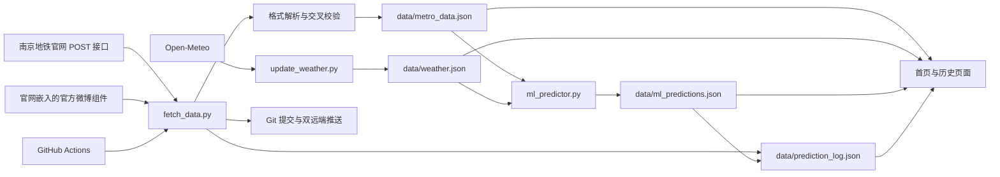

# 南京地铁客流数据可视化平台技术报告

> 报告基准日期：2026-07-30
> 代码基准：2026-07-30 天气自动化改造版本
> 最新实际客流日期：2026-07-28

## 1. 项目概述

本项目是一个面向南京地铁线网客流的纯静态数据看板。它没有在线应用服务器和数据库，而是通过 Python 脚本离线抓取、校验、训练模型并生成 JSON 文件，再由浏览器端 HTML、JavaScript 和 ECharts 读取这些静态文件完成展示。

这种架构的核心特点是：

| 特性 | 实现方式 |
|---|---|
| 数据获取 | Python 标准库访问南京地铁官网接口及官网嵌入的官方微博组件 |
| 数据存储 | 仓库内版本化 JSON 文件 |
| 预测训练 | 独立 Python 模块离线训练，不依赖 NumPy、pandas 或 scikit-learn |
| 线路预测 | 线网总量和 14 条线路分别训练独立模型 |
| 数据展示 | 纯静态 HTML、CSS、JavaScript、ECharts |
| 自动更新 | GitHub Actions 定时运行，数据变化时自动提交 |
| 发布 | GitHub Pages、Vercel、Gitee 或任意静态文件服务器 |

截至报告日期，主数据集包含 2025-01-01 至 2026-07-28 共 571 条日记录，配置 14 条线路。当前独立预测模块版本为 `2.0.0`，线网模型的时间验证 MAE 为 14.27 万人次，MAPE 为 4.35%。

## 2. 总体架构



系统可以划分为五层：

| 层次 | 主要文件 | 职责 |
|---|---|---|
| 来源层 | 南京地铁官网、官方微博组件、Open-Meteo | 提供客流总量、线路明细和天气信息 |
| 采集与质量层 | `scripts/fetch_data.py`、`scripts/update_weather.py` | 请求、解析、交叉校验、异常识别和原子写入 |
| 数据层 | `data/*.json` | 保存历史事实、天气、预测结果和预测评估 |
| 建模层 | `scripts/ml_predictor.py` | 特征构造、时间验证、选模、训练和分层预测 |
| 展示与发布层 | `index.html`、`lines.html`、`history.html`、`js/main.js` | 静态展示、交互分析、规则兜底和站点发布 |

## 3. 数据爬取与更新脚本

### 3.1 数据来源

客流更新入口为 [`scripts/fetch_data.py`](../scripts/fetch_data.py)。脚本使用两个相互补充的官方来源：

| 来源 | 请求方式 | 主要用途 |
|---|---|---|
| 南京地铁首页客流接口 | POST `https://www.njmetro.com.cn/njdtweb/portal/get-lineIntro.do` | 获取官网首页显示的昨日线网总客流 |
| 南京地铁官网嵌入的官方微博组件 | GET `https://widget.weibo.com/weiboshow/...` | 获取带明确日期和 14 条线路明细的完整公告 |

官网首页本身通过 JavaScript 动态加载客流数字，因此脚本没有只抓取 `dtmain.jsp` 的静态 HTML，而是直接调用首页实际使用的 POST 接口。请求参数中的 `rowId` 固定为官网客流栏目记录 ID，接口返回 JSON，脚本从 `articleTitle` 读取总客流。

线路明细来自官网首页嵌入的南京地铁官方微博组件。请求附带官网 `Referer`，并增加毫秒级防缓存参数、`Cache-Control: no-cache` 和 `Pragma: no-cache`，降低读取旧公告的概率。

### 3.2 网络兼容处理

脚本仅使用 Python 标准库 `urllib.request`，默认超时为 30 秒，并模拟常见浏览器请求头。响应按以下顺序尝试解码：

1. HTTP 响应头声明的字符集。
2. UTF-8。
3. GB18030。
4. GBK。
5. 前述方式均失败时，以 UTF-8 替换非法字符。

南京地铁旧站点存在证书链兼容问题。正常证书验证失败且错误被识别为 `CERTIFICATE_VERIFY_FAILED` 时，脚本会记录警告并使用不验证证书的 SSL 上下文重试。这个机制提高了旧站可用性，但会降低传输层身份校验强度，应视为兼容措施而非理想长期方案。

### 3.3 公告文本解析

解析前会执行以下归一化：

| 步骤 | 目的 |
|---|---|
| HTML 实体反解 | 将 `&nbsp;` 等实体还原为文本 |
| Unicode 转义还原 | 将页面中的 `\uXXXX` 转义恢复为汉字 |
| 删除 HTML 标签 | 获得连续公告文本 |
| 删除零宽字符、BOM、不换行空格 | 避免正则被不可见字符打断 |
| 合并空白 | 兼容网页换行和不同排版 |

主正则兼容以下公告差异：

- `南京地铁7月24日客运量...` 与 `南京地铁7月24日线网客运量...`。
- `客运量371.37` 与 `客运量为371.37`。
- 中文或英文冒号、逗号和括号。
- `#昨日客流#` 存在或缺失。
- 两位或四位显式年份。
- 公告只写日、不写月时的近月推断。
- 跨年时从参考日期前后一年中选择最近的合法日期。

线路解析为 14 个稳定 ID：`L1`、`L2`、`L3`、`L4`、`L5`、`L7`、`L10`、`S1`、`S2`、`S3`、`S6`、`S7`、`S8`、`S9`。公告中的“停运”或“全天停运”会被转换为该线路客流 `0.0`，同时在 `note` 中保存停运线路列表。

### 3.4 来源交叉校验

脚本不会盲目信任单一文本，而是组合官网总量和带日期明细：

1. 先读取官网无日期的“昨日总量”。
2. 再解析微博组件中最近多天的带日期公告。
3. 如果昨日明细存在，比较明细总量与官网总量。
4. 两者相差超过 0.01 万时，以日期明确的完整公告为准，并记录提示。
5. 如果明细尚未出现，而官网总量与现有记录均不重复，则可生成“线路明细待补”的总量记录。
6. 后续获取到同日完整明细时，用线路数更多的记录替换总量记录。

为避免截断页面或正则误匹配污染数据，单条公告还必须通过两级完整性检查：

| 校验 | 当前阈值 | 处理 |
|---|---:|---|
| 最少线路状态数 | 10 条 | 少于 10 条直接跳过 |
| 总量与线路合计最大差异 | 5.0 万 | 超出阈值直接跳过 |
| 总量与线路合计提示阈值 | 0.5 万 | 超出时警告，但保留官方原值 |

0.01 万左右的差异通常来自各线路只保留两位小数，属于正常舍入误差。

### 3.5 增量更新与修正

`update_metro_data()` 按日期执行幂等更新：

| 情况 | 行为 |
|---|---|
| 日期不存在 | 新增记录 |
| 日期存在且总量变化 | 使用官网修正值覆盖 |
| 日期存在且新记录线路更完整 | 补齐线路明细 |
| 日期、总量和明细均无改善 | 不修改文件 |

发生变化后，数据按日期升序排列，并更新 `metadata.last_updated`、`metadata.fetched_at` 和 `metadata.data_source`。写入采用“同目录临时文件 + `os.replace`”的原子替换方式，避免进程中断留下半截 JSON。

### 3.6 发布前全量校验

每次更新后会重新验证整个 `metro_data.json`：

- `daily_data` 必须为非空数组。
- 日期必须符合 `YYYY-MM-DD`，不得重复、不得晚于当前日期。
- 总客流必须为 0 到 1000 万之间的数字。
- 普通记录至少包含 10 条线路状态。
- “明细待补”记录允许暂时没有线路数据。
- 所有线路值必须可转换为数字。
- 总量与线路合计差异不得超过 5 万。
- 数据必须保持日期升序。

校验失败会阻止模型生成、提交和发布，防止错误数据进入公开站点。

### 3.7 退出码与自动任务语义

| 退出码 | 含义 | GitHub Actions 处理 |
|---:|---|---|
| `0` | 成功或无需更新 | 正常结束 |
| `1` | Git 提交或推送失败 | 任务失败 |
| `2` | 所有来源暂时不可访问 | 最多重试 3 次，仍失败则等待后续计划任务 |
| `3` | 官网可访问，但要求的昨日数据尚未发布 | 正常结束，等待下一轮 |
| `4` | 页面可达但解析失败、数据或预测校验失败 | 视为真实故障并报警 |

这种区分很重要：官网尚未发布和临时网络波动不是程序缺陷，不应每天产生失败邮件；页面结构变化、数据完整性异常和模型输出损坏才需要人工处理。

## 4. 数据存储设计

### 4.1 `metro_data.json`

[`data/metro_data.json`](../data/metro_data.json) 是核心事实表，结构由元数据、日记录和遗留统计区组成。

```json
{
  "metadata": {
    "city": "南京",
    "system": "南京地铁",
    "data_source": "南京地铁官网首页（官方微博线路明细）",
    "last_updated": "2026-07-29",
    "fetched_at": "2026-07-29 12:48:35",
    "lines_count": 14,
    "lines": [
      {"id": "L1", "name": "1号线", "color": "#009ACE", "type": "main"}
    ]
  },
  "daily_data": [
    {
      "date": "2026-07-28",
      "total": 348.65,
      "is_weekend": false,
      "note": "",
      "lines": {"L1": 61.76, "L2": 54.08}
    }
  ],
  "statistics": {}
}
```

客流单位统一为“万人次”。线路字典允许历史上尚未开通的线路缺失，而不是强制写零。例如 5 号线从 2025-03-12 起有记录，S2 号线从 2026-04-22 起有记录。

当前线路覆盖情况如下：

| 线路 | 有效覆盖天数 | 首次记录 | 停运零值 |
|---|---:|---|---:|
| 1、2、3、4、7、10、S3 | 各 571 | 2025-01-01 | 0 |
| 5 | 501 | 2025-03-12 | 0 |
| S1、S6、S7、S8、S9 | 各 571 | 2025-01-01 | 各 1 |
| S2 | 95 | 2026-04-22 | 1 |

### 4.2 `weather.json`

[`data/weather.json`](../data/weather.json) 是天气和节假日特征表，每条记录包括：

```json
{
  "date": "2026-07-16",
  "temp_max": 34.5,
  "temp_min": 28.1,
  "weather": "雨",
  "precipitation": 0.9,
  "weather_code": 51,
  "wind_speed_max": 12.5,
  "is_rainy": true,
  "is_heavy_rain": false,
  "is_holiday": false,
  "is_holiday_eve": false
}
```

独立模块 [`scripts/update_weather.py`](../scripts/update_weather.py) 使用 Python 标准库通过 HTTPS 调用 Open-Meteo 南京坐标，默认回补最近 14 天并维护未来 7 天的最高温、最低温、天气代码、降水、降雪和最大风速。模块按 WMO 天气代码分别识别雨、强降雨、雪和雷暴，不再用简单数值范围造成交叉误判；同时依据国务院通知修正 2025—2026 年节假日及节前日标志。更新采用原子写入，完成后重新训练并校验机器学习预测。根目录 [`update_weather.sh`](../update_weather.sh) 只是无绝对路径的可移植包装器。

截至报告日期，天气表包含 2025-01-01 至 2026-08-05 共 570 条记录。更新器会在每次运行时重新计算所有历史记录的确定性天气分类和已知年度节假日标记，因此旧脚本留下的“雷暴误标为雪”等问题能够自动修复。一次性 92 天回补已将客流日期的天气缺口从 27 天降至 12 天；剩余缺口早于接口当前可返回的完整历史窗口，不使用猜测值填充。

### 4.3 `ml_predictions.json`

[`data/ml_predictions.json`](../data/ml_predictions.json) 是完整的模型产物，不只保存最终数字，还保存：

- 模型名称、版本、策略和算法说明。
- 训练窗口、训练起止日期和有效样本数。
- 岭回归参数、特征均值、标准差和系数。
- 时间验证范围、折数、候选数、MAE、RMSE、MAPE。
- 误差区间半径。
- 14 条线路各自的模型元数据。
- 未来每日线网预测、线路预测、输入特征摘要和分层校准因子。

该设计使预测可审计、可复现，也使前端无需在线调用模型服务。

### 4.4 `prediction_log.json`

[`data/prediction_log.json`](../data/prediction_log.json) 用于到数后的真实评估：

| 字段 | 用途 |
|---|---|
| `predictions` | 按日期持久化当时的预测，避免到数后用新模型倒算 |
| `comparison` | 保存实际值、原预测、误差、绝对误差和百分比误差 |
| `stats` | 汇总比较次数、累计 MAE、平均偏差和更新时间 |

当前累计 116 条比较记录，历史累计 MAE 为 26.95 万，平均偏差为 -2.42 万。该累计值混合了旧规则模型和不同版本的机器学习模型，不能直接等同于当前 `2.0.0` 模型的验证 MAE。

## 5. 机器学习预测模块

### 5.1 设计目标

[`scripts/ml_predictor.py`](../scripts/ml_predictor.py) 是独立预测模块，目标不是采用复杂度最高的算法，而是在当前约 1.5 年日数据规模下实现以下工程要求：

1. 避免随机切分造成时间泄漏。
2. 同时刻画星期周期、年度季节性、近期惯性、天气和节假日影响。
3. 每条线路根据自身历史独立选择策略。
4. 处理新线路、小样本、缺失日期和停运日。
5. 保证线路预测合计严格等于线网总预测。
6. 不依赖第三方机器学习包，确保本地和 GitHub Actions 结果一致。
7. 将训练参数和验证结果完整写入静态 JSON。

模型名称为 `adaptive-time-series-ensemble`。它不是单一岭回归，而是“多特征岭回归 + 同星期季节基线”的自适应集成模型。

### 5.2 独立序列建模

模块共训练 15 个时间序列：

- 1 个线网总客流序列。
- 14 个线路客流序列。

每个序列分别执行样本构建、训练窗口选择、岭参数选择、基线类型选择和融合权重选择。因此，不同线路可以得到不同的模型。例如客流稳定的线路可能依赖岭回归，新线路可能更适合近期同星期基线，变化较快的线路可能选择近期加权基线。

### 5.3 样本构建与数据清洗

模型按日期升序处理数据。线网目标使用 `total`，线路目标使用各自的 `lines[line_id]`。

停运处理遵循“目标排除、历史保留”：

| 场景 | 训练目标 | 滞后与季节特征 |
|---|---|---|
| 线网停运或运营中断日 | 从线网目标中排除 | 原始值仍可保留在历史序列 |
| 单线路停运或客流为 0 | 只从该线路目标中排除 | 不影响其他线路模型 |
| 其他线路正常运行 | 正常参与训练 | 正常参与特征构造 |

这样可以避免用异常停运客流拟合常规运营目标，同时保留真实运营中断对后续日滞后特征的影响。

滞后特征允许少量日期缺失。程序在向前 60 天内搜集最近 7 个可用值，至少找到 5 个才生成样本。`lag_1` 优先使用严格前一天，缺失时退化为最近可用值；`lag_7` 优先使用严格前七天，缺失时依次查找更早的同星期记录。

### 5.4 特征工程

每条训练样本包含 23 个特征：

| 类别 | 特征 | 实现含义 |
|---|---|---|
| 截距 | `intercept` | 常数 1，不参与岭惩罚 |
| 星期周期 | `weekday_mon` 至 `weekday_sun` | 7 维星期独热编码 |
| 年度周期 | `annual_sin`、`annual_cos` | 以 365.25 天为周期的正余弦编码 |
| 日历 | `is_holiday`、`is_holiday_eve` | 法定节假日及节前日标志 |
| 天气状态 | `is_rainy`、`is_heavy_rain` | 降雨和强降雨标志 |
| 连续天气 | `temperature_mean`、`precipitation` | 日均温和日降水量 |
| 短期惯性 | `lag_1`、`lag_7`、`rolling_7` | 前一日、前七日、最近七个有效日均值 |
| 周期基线 | `same_weekday_4`、`same_weekday_8` | 最近 4 周、8 周同星期均值 |
| 同比信息 | `year_ago_same_weekday`、`has_year_ago` | 364 天前同星期值及可用性标志 |

364 天等于 52 周，使用它而非 365 天可以保持星期对齐。

### 5.5 天气特征回退

预测目标日的天气处理分三级：

1. `weather.json` 有目标日记录时，直接使用精确天气。
2. 目标日缺失时，在之前 30 天中寻找最近 7 条天气并取平均。
3. 完全没有天气数据时，使用均温 15°C、降水 0、无节假日和无降雨的默认气候。

使用近期平均时，节假日和节前日标志强制为假，降雨标志根据最近记录中是否至少一半为真重新二值化。这保证数据类型稳定，但也意味着未来节假日如果没有显式天气记录，就不会自动获得正确节假日特征。

### 5.6 岭回归实现

模块自行实现岭回归。设训练矩阵为 \(X\)，目标为 \(y\)，正则化系数为 \(\alpha\)，模型求解：

\[
\hat{\beta} = (X^T X + \alpha I)^{-1}X^T y
\]

实现细节如下：

- 截距列保持原值，不标准化、不施加正则惩罚。
- 其余特征按训练集均值和总体标准差标准化。
- 常量特征的标准差回退为 1，避免除零。
- 正规方程通过带部分主元选择的高斯消元求解。
- 主元绝对值小于 `1e-12` 时判定矩阵不可逆并停止训练。
- 最终输出保存特征均值、尺度和全部权重，便于复现单次预测。

岭回归适合当前项目的原因是：样本规模有限、特征之间高度相关、需要低依赖和高可解释性。`lag_7`、同星期均值、滚动均值之间存在明显共线性，L2 正则化可以降低普通最小二乘系数不稳定的问题。

### 5.7 同星期基线

候选基线有两种：

| 基线 | 公式 |
|---|---|
| 最近 4 个同星期算术均值 | 最近四周同一星期几客流的简单平均 |
| 最近 4 个同星期加权均值 | 权重依次为 0.4、0.3、0.2、0.1，越近权重越高 |

同星期基线直接利用城市轨道交通最强的七日周期，可以在节奏稳定或样本不足时提供比高维回归更稳健的结果。

### 5.8 集成预测

最终预测不是固定使用岭回归，而是对岭回归和基线进行凸组合：

\[
\hat{y} = (1-w)\hat{y}_{ridge} + w\hat{y}_{baseline}, \quad w \in \{0,0.1,\ldots,1.0\}
\]

策略名称由最优权重决定：

| 条件 | 策略名称 |
|---|---|
| `w = 0` | `ridge-regression` |
| `w = 1` | 纯同星期基线 |
| `0 < w < 1` | 岭回归与对应基线的集成 |

预测值最后限制为不小于 0。

### 5.9 时间滚动验证与自动选模

模型严格按时间顺序验证，不随机打乱数据。完整流程如下：

1. 计算验证块大小：`min(28, max(14, 样本数 // 8))`。
2. 在保证每折训练集至少 60 条样本的前提下，最多建立 3 个扩展窗口验证折。
3. 每一折只使用该验证块之前的数据训练。
4. 分别评估训练窗口、岭参数、基线类型和融合权重。
5. 以所有验证折汇总 MAE 最小的候选为最终策略。
6. 使用选中的训练窗口重新训练最终模型。

候选空间为：

| 参数 | 候选值 |
|---|---|
| 训练窗口 | 最近 180 天、最近 365 天、全部历史 |
| 岭参数 `alpha` | 0.1、1、10、50、100、300、500、1000 |
| 基线 | 算术同星期均值、近期加权同星期均值 |
| 基线权重 `w` | 0.0 至 1.0，步长 0.1 |

当 `w=0` 时两个基线等价，因此只保留一个纯岭候选。每组训练窗口和 alpha 有 21 种有效融合配置，完整候选数为：

\[
3 \times 8 \times 21 = 504
\]

样本少于 `60 + 14 = 74` 条时，不强行拟合高维回归，而是使用最近 14 条样本验证“近期加权同星期基线”。这是新线路的小样本保护机制。

### 5.10 验证指标和预测区间

模块记录以下指标：

| 指标 | 含义 |
|---|---|
| MAE | 平均绝对误差，单位为万人次 |
| RMSE | 均方根误差，对大误差更敏感 |
| MAPE | 平均绝对百分比误差，只统计实际值大于 0 的样本 |
| `interval_radius` | 验证残差绝对值的 90% 分位数 |

点预测区间为：

\[
[\max(0, \hat{y}-r_{0.9}), \hat{y}+r_{0.9}]
\]

这里的区间是基于历史绝对残差的经验误差带，不是严格概率模型产生的置信区间。它能表达近期验证误差尺度，但没有对不同星期、节假日或异方差单独建模。

### 5.11 当前线网模型

截至 2026-07-28，线网模型配置为：

| 项目 | 当前值 |
|---|---|
| 策略 | 岭回归 + 最近 4 个同星期算术均值 |
| 训练窗口 | 最近 365 天 |
| alpha | 0.1 |
| 岭回归权重 | 0.6 |
| 同星期基线权重 | 0.4 |
| 最终训练样本 | 361 |
| 训练范围 | 2025-07-29 至 2026-07-28 |
| 验证范围 | 2026-05-02 至 2026-07-28 |
| 验证折数 | 3 |
| 候选数 | 504 |
| 验证 MAE | 14.27 万 |
| 验证 RMSE | 21.90 万 |
| 验证 MAPE | 4.35% |
| 误差区间半径 | 26.05 万 |

### 5.12 当前 14 条线路的独立策略

| 线路 | 训练窗口 | alpha | 岭权重 | 基线权重 | 基线 | 验证 MAE | MAPE |
|---|---:|---:|---:|---:|---|---:|---:|
| 1号线 | 365天 | 0.1 | 0.5 | 0.5 | 4周算术均值 | 3.62 | 9.14% |
| 2号线 | 365天 | 0.1 | 0.6 | 0.4 | 4周算术均值 | 3.13 | 7.98% |
| 3号线 | 365天 | 300 | 0.9 | 0.1 | 4周近期加权 | 3.24 | 7.51% |
| 4号线 | 365天 | 50 | 0.7 | 0.3 | 4周近期加权 | 0.90 | 7.35% |
| 5号线 | 全部 | 100 | 0.8 | 0.2 | 4周算术均值 | 2.05 | 7.29% |
| 7号线 | 365天 | 100 | 0.9 | 0.1 | 4周算术均值 | 1.45 | 6.65% |
| 10号线 | 365天 | 10 | 0.6 | 0.4 | 4周算术均值 | 1.03 | 9.95% |
| S1号线 | 365天 | 500 | 0.9 | 0.1 | 4周算术均值 | 0.56 | 5.47% |
| S2号线 | 180天 | 300 | 1.0 | 0.0 | 无融合，纯岭回归 | 0.33 | 9.25% |
| S3号线 | 365天 | 1 | 0.7 | 0.3 | 4周算术均值 | 0.44 | 7.42% |
| S6号线 | 全部 | 500 | 0.8 | 0.2 | 4周算术均值 | 0.29 | 5.52% |
| S7号线 | 365天 | 300 | 0.9 | 0.1 | 4周算术均值 | 0.08 | 5.58% |
| S8号线 | 365天 | 100 | 0.7 | 0.3 | 4周算术均值 | 0.45 | 4.62% |
| S9号线 | 全部 | 300 | 0.9 | 0.1 | 4周算术均值 | 0.27 | 11.57% |

这张表说明“每条线路独立策略”不是展示层标签，而是实际训练结果。例如 S2 号线历史短，模型选择 180 天窗口和纯岭回归；3、4 号线选择近期加权基线，其他线路当前更适合算术同星期基线。

### 5.13 多日递归预测

默认生成未来两天预测。第一天预测完成后，线网点预测和每条线路校准后的点预测会写入内存中的递归序列，第二天的 `lag_1`、`rolling_7` 等特征因此可以使用第一天预测。

这种方法支持任意 `--forecast-days`，但预测步数越长，前序预测误差会逐步传递，区间目前没有显式累积递归不确定性。

### 5.14 线路分层校准

各线路先独立产生原始预测，随后按线网总预测统一校准。设线网预测为 \(T\)，线路原始预测为 \(l_i\)，校准因子为：

\[
k = \frac{T}{\sum_i l_i}
\]

每条线路最终预测为：

\[
\tilde{l_i} = k \cdot l_i
\]

线路上下界也按同一因子缩放。保留两位小数后如果仍有 0.01 万级舍入差，程序把差值加到预测量最大的线路，并再次保证区间包含点预测。

该步骤确保：

\[
\sum_i \tilde{l_i} = T
\]

当前 2026-07-29 预测中，线路原始合计为 353.01 万，线网预测为 354.47 万，校准因子为 1.004148，最终线路合计严格等于 354.47 万。

### 5.15 当前预测示例

| 日期 | 点预测 | 下界 | 上界 | 天气来源 |
|---|---:|---:|---:|---|
| 2026-07-29 | 354.47 | 328.42 | 380.52 | Open-Meteo 精确天气 |
| 2026-07-30 | 345.21 | 319.16 | 371.26 | Open-Meteo 精确天气 |

2026-07-29 的线网模型分量为岭回归 356.37 万、同星期基线 351.62 万，按 0.6/0.4 融合后得到 354.47 万。

## 6. 预测评估闭环

新实际数据到达时，`fetch_data.py` 会在重新训练前寻找当日旧预测，保证评估使用真正提前生成的结果：

1. 优先读取 `prediction_log.predictions[日期]` 中已冻结的预测。
2. 如果尚未冻结，则读取更新前 `ml_predictions.json` 中对应日期预测并写入日志。
3. 如果机器学习预测也不存在，才使用旧版规则基线补充评估。
4. 计算 `实际 - 预测`、绝对误差和百分比误差。
5. 同日官网修正时覆盖旧比较记录，避免重复计数。
6. 更新累计 MAE 和平均偏差。

当前最近两次真实对比为：

| 日期 | 实际 | 原预测 | 绝对误差 | 百分比误差 |
|---|---:|---:|---:|---:|
| 2026-07-27 | 351.55 | 324.19 | 27.36 | 8.44% |
| 2026-07-28 | 348.65 | 337.53 | 11.12 | 3.29% |

时间验证用于开发期选模，`prediction_log` 用于上线后的真实滚动监控，二者承担不同职责。

## 7. 前端展示实现

### 7.1 首页

[`index.html`](../index.html) 和 [`js/main.js`](../js/main.js) 并行读取四个 JSON 文件：

- `metro_data.json`：实际客流、线路配置和历史趋势。
- `weather.json`：天气和节假日因素。
- `prediction_log.json`：累计评估统计。
- `ml_predictions.json`：未来线网和线路预测。

首页按日期精确匹配 `ml_predictions.forecasts`。匹配成功时展示机器学习预测、变化率、区间和模型因素；文件缺失、加载失败或目标日期不在预测范围时，才调用浏览器内旧规则引擎。

旧规则引擎主要使用最近四个同星期均值、趋势微调、月份系数、节假日特殊规则和雨天折减。它是可用性兜底，不是当前主模型。

### 7.2 线路页面

[`lines.html`](../lines.html) 同时读取客流和机器学习预测文件。选择单条线路后会展示：

- 历史最大、最小和平均客流。
- 未来两天独立线路预测。
- 线路预测区间。
- 选中的模型策略。
- 训练窗口和有效训练样本数。
- 时间验证 MAE。

“所有线路”视图用于历史对比，不展示单线路预测卡片。

### 7.3 历史页面

[`history.html`](../history.html) 动态扫描历史记录中的全部线路 ID，生成表头和数据列，支持日期筛选、升降序、按客流排序和 CSV 导出。尚未开通或缺失线路显示为 `-`。

## 8. 自动化与发布

### 8.1 GitHub Actions

客流工作流 [`.github/workflows/update-metro-data.yml`](../.github/workflows/update-metro-data.yml) 在北京时间 09:47 至 21:47 每小时错峰检查一次；天气工作流 [`.github/workflows/update-weather.yml`](../.github/workflows/update-weather.yml) 每天 08:17 更新最近天气和未来 7 天预报。两者都支持手动触发。

每次工作流执行以下步骤：

1. 拉取完整仓库历史。
2. 安装 Python 3.11。
3. 编译检查抓取和预测脚本。
4. 运行抓取解析测试和机器学习测试。
5. 设置 `METRO_REQUIRE_YESTERDAY=1`，要求检查昨日数据。
6. 数据源暂时不可用时最多重试 3 次，每次间隔 60 秒。
7. 使用 `METRO_SKIP_GIT=1` 禁用 Python 脚本内部提交。
8. 三个核心数据文件有变化时由 Actions 统一提交。
9. GitHub 推送失败时最多重试 3 次，每次间隔 15 秒。
10. 配置 `GITEE_TOKEN` 时同步 Gitee，否则明确跳过但不判失败。

两个工作流的 `concurrency.group` 统一为 `nanjing-metro-data-write`，且不取消正在运行的任务。由于客流和天气任务都会重新生成 `ml_predictions.json`，共享并发锁可以避免并行提交和推送冲突。

天气工作流在提交前执行 Python 编译检查、天气模块测试和机器学习测试。Open-Meteo 暂时不可用时记录警告并等待次日重试；响应结构、天气数值、预测基准日或线路合计异常时则停止发布。数据变化时只提交 `weather.json` 和 `ml_predictions.json`，GitHub 推送最多重试三次，并在配置 `GITEE_TOKEN` 时同步 Gitee。

### 8.2 本地直接运行

```bash
python3 scripts/fetch_data.py
```

本地运行会自行提交三个数据文件，并推送 `origin` 和 `gitee`。针对超时、DNS、连接重置、HTTP/2 和 TLS 类瞬时故障，单个远端最多尝试 3 次，等待时间为 5 秒和 15 秒。认证失败等非网络错误不会盲目重试。

### 8.3 静态构建

[`scripts/build-static.sh`](../scripts/build-static.sh) 生成 `dist/`，只复制三个页面、样式、JavaScript、Logo 和四个公开 JSON，不包含抓取脚本、中间文本或测试代码。

[`vercel.json`](../vercel.json) 将项目作为静态站点发布，并为 `/data/*` 设置 JSON 内容类型和跨域读取头。

## 9. 测试与质量保障

### 9.1 抓取测试

[`scripts/test_fetch_data.py`](../scripts/test_fetch_data.py) 覆盖：

- 两位年份和跨年日期推断。
- 官网 API JSON 解析。
- SSL 验证错误识别。
- 无 `#昨日客流#` 的官网文本。
- 不完整线路数据拒绝。
- 停运线路转零及备注。
- 总量与线路合计异常拒绝。
- 多种公告格式混合回填。
- “线网客运量”措辞。
- 过时官网总量与日期明确公告的优先级。
- 微博缓存绕过。
- 网络失败与解析失败退出码区分。
- 日期重复、未来日期和分层预测一致性。
- GitHub 瞬时推送错误分类和重试成功路径。

### 9.2 机器学习测试

[`scripts/test_ml_predictor.py`](../scripts/test_ml_predictor.py) 使用合成时间序列验证：

- 预测文件 schema v2 正确生成。
- 线网和每条线路均产生独立模型。
- 新线路使用更短的自身历史。
- 停运目标被对应模型排除。
- 精确目标日天气被使用。
- 未来两天预测和区间有效。
- 线路合计严格等于线网预测。
- 最近历史存在日期缺口时仍可预测。

当前测试属于轻量脚本测试，适合无依赖 CI，但尚未包含浏览器端自动化测试和真实数据阈值回归测试。

### 9.3 天气更新测试

[`scripts/test_update_weather.py`](../scripts/test_update_weather.py) 覆盖 Open-Meteo 当前参数、响应并行数组校验、WMO 天气分类、雷暴与降雪互斥、强降雨识别、2026 年官方节假日、旧错误节假日修复、日期合并排序和原子 JSON 写入。

## 10. 当前数据与模型风险

### 10.1 天气来源仍需持续监控

天气自动更新现已独立运行，并会确保公开预测使用目标日精确天气。剩余风险主要是 Open-Meteo 单一外部来源短时不可用、远期预报自然存在误差，以及新年度国务院节假日通知发布后仍需维护日历表。工作流会区分临时来源故障与真实数据错误，避免用空响应覆盖现有文件。

### 10.2 历史数据包含预估值

以下 4 条记录标记为预估，但当前仍作为普通训练目标参与模型：

| 日期 | 总客流 |
|---|---:|
| 2026-04-30 | 337.5 |
| 2026-05-02 | 396.5 |
| 2026-05-03 | 329.8 |
| 2026-05-04 | 335.8 |

影响：模型验证范围恰好从 2026-04-30 开始，预估记录会同时影响验证评价和后续滞后特征。

### 10.3 累计评估混合模型版本

`prediction_log` 的 116 条比较混合旧规则、旧岭回归和当前集成模型。代码在冻结机器学习预测时仍写入遗留标签 `ridge-regression-v1`，即使实际预测来自 `adaptive-time-series-ensemble 2.0.0`。

影响：无法按模型版本准确比较上线表现，累计 MAE 26.95 万不代表当前版本能力。

### 10.4 `statistics` 遗留字段异常

`metro_data.json.statistics.max_daily.date` 和 `min_daily.date` 当前保存了数值而不是日期，且抓取脚本不会自动重算该区块。前端主要从 `daily_data` 实时计算统计，因此页面核心功能不受影响，但该字段不应作为外部数据接口使用。

### 10.5 时间验证仍存在选择偏差

当前模型使用同一组滚动验证折完成 504 个候选的选择和指标报告。这个指标适合相对选模，但不是完全独立的最终测试集；候选越多，最优验证值越可能偏乐观。

### 10.6 区间不是概率预测

预测上下界是历史绝对残差 90% 分位数形成的对称误差带。它没有针对工作日、周末、节假日和暴雨分别校准，也没有在第二天递归预测时扩大不确定性。

### 10.7 外生事件覆盖有限

模型尚未显式使用大型演唱会、展会、学校开学、调休工作日、线路施工、临时限流等变量。这类事件可能显著改变单日客流，但仅靠历史和天气难以提前识别。

## 11. 优化建议

### P0：优先保证输入数据质量

| 建议 | 预期收益 |
|---|---|
| 已完成：天气更新加入独立 GitHub Actions，并自动重训模型 | 未来两日使用精确天气预报 |
| 继续维护国务院年度节假日表，并考虑独立日历数据文件 | 避免新年度节假日标记过期 |
| 为日记录增加 `quality: official/estimated/pending` | 可明确排除预估目标或降低其权重 |
| 自动识别并回补 4 条预估记录 | 避免预估值污染验证和训练 |

### P1：完善模型评估治理

| 建议 | 预期收益 |
|---|---|
| `prediction_log` 保存模型名称、版本、训练基准日和线路预测 | 可按版本、线路、星期和节假日评估 |
| 增加完全未参与选模的最终留出集 | 获得更客观的泛化指标 |
| 持久化每条线路真实滚动误差 | 发现某条线路模型长期失准 |
| 增加最近 7、30、90 天滚动 MAE/MAPE | 避免全历史累计值掩盖近期退化 |
| 修复 `statistics` 并由更新脚本统一重算 | 保持数据契约一致 |

### P2：进一步提升预测精度

| 建议 | 适用条件 |
|---|---|
| 增加调休工作日、寒暑假、开学、重大活动特征 | 获取稳定日历和事件数据后 |
| 使用时间序列交叉验证比较 LightGBM/CatBoost | 允许引入第三方依赖且数据质量稳定后 |
| 对线网和线路采用残差二阶段模型 | 当前线性模型出现稳定可解释残差时 |
| 使用分组 conformal prediction 校准区间 | 累积足够的真实滚动预测后 |
| 使用 MinT 等层级预测校准 | 具备稳定残差协方差估计后 |

在当前 571 条日样本规模下，不建议仅为了“更像机器学习”直接替换为深度神经网络。数据质量、天气时效、节假日与事件特征、严格评估流程对精度的影响通常大于模型复杂度。

## 12. 运行手册

### 更新客流并自动发布

```bash
python3 scripts/fetch_data.py
```

### 单独重新训练未来两日预测

```bash
python3 scripts/ml_predictor.py
```

### 生成未来七日预测

```bash
python3 scripts/ml_predictor.py --forecast-days 7
```

### 指定预测起始日期

```bash
python3 scripts/ml_predictor.py --forecast-days 7 --start-date 2026-07-29
```

起始日期必须晚于最新实际客流日期。

### 更新天气并重新训练

```bash
./update_weather.sh
# 等价于：python3 scripts/update_weather.py
```

天气模块不依赖第三方 Python 包。默认更新最近 14 天和未来 7 天；也可通过 `--past-days`、`--forecast-days` 调整范围，或使用 `--dry-run` 只验证接口而不写文件。

### 运行测试

```bash
python3 scripts/test_fetch_data.py
python3 scripts/test_ml_predictor.py
python3 scripts/test_update_weather.py
python3 -m py_compile scripts/fetch_data.py scripts/ml_predictor.py scripts/update_weather.py
```

### 本地预览

```bash
python3 -m http.server 8080
```

### 构建精简静态站点

```bash
bash scripts/build-static.sh
python3 -m http.server 8080 -d dist
```

## 13. 结论

本项目已经形成完整的“官方数据抓取、质量校验、历史存储、独立机器学习训练、分线路预测、真实误差跟踪、静态展示和自动发布”闭环。

预测模块的核心价值不在于单一岭回归，而在于以下组合：

- 23 维时间、天气、日历和滞后特征。
- 适合小数据的标准化岭回归。
- 强星期周期的两种季节基线。
- 504 组候选的时间滚动验证选模。
- 线网和 14 条线路完全独立的策略选择。
- 新线路小样本保护和停运目标排除。
- 多日递归预测和线网/线路分层一致性校准。
- 完整模型元数据和上线后真实误差闭环。

当前模型在工程可解释性、部署稳定性和小样本适配方面较合理。下一阶段最值得投入的不是立刻增加模型复杂度，而是自动更新天气、治理预估记录、完善节假日与事件特征，并建立按模型版本和线路拆分的真实滚动评估体系。
